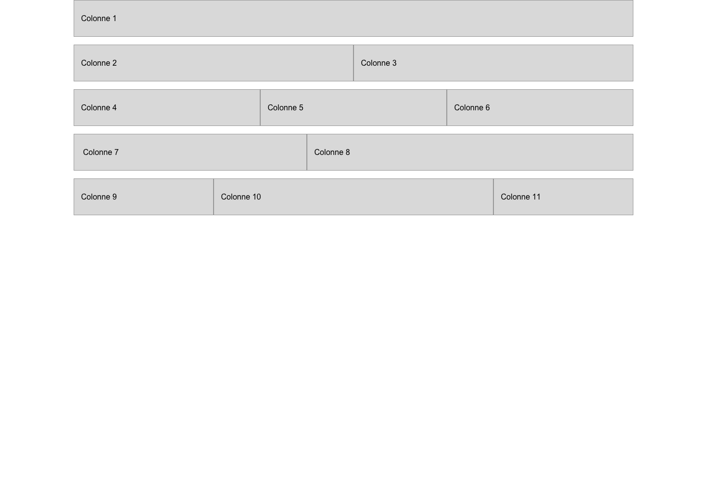

# Exercice Bootstrap 1 - Layout Desktop

Intégrez les 2 maquettes en utilisant la grille Bootstrap.

Les éléments nécessaires à l'intégration se trouvent dans le dossier **\_consigne**.

Afin de rendre les colonnes visibles, vous pouvez utiliser la CSS suivante:

```CSS
.row + .row {
  margin-top: 16px;
}

.row > .col,
.row > [class^=col-] {
  padding-top: 12px;
  padding-bottom: 12px;
  background-color: rgba(86, 61, 124, .15);
  border: 1px solid rgba(86, 61, 124, .2);
}
```



